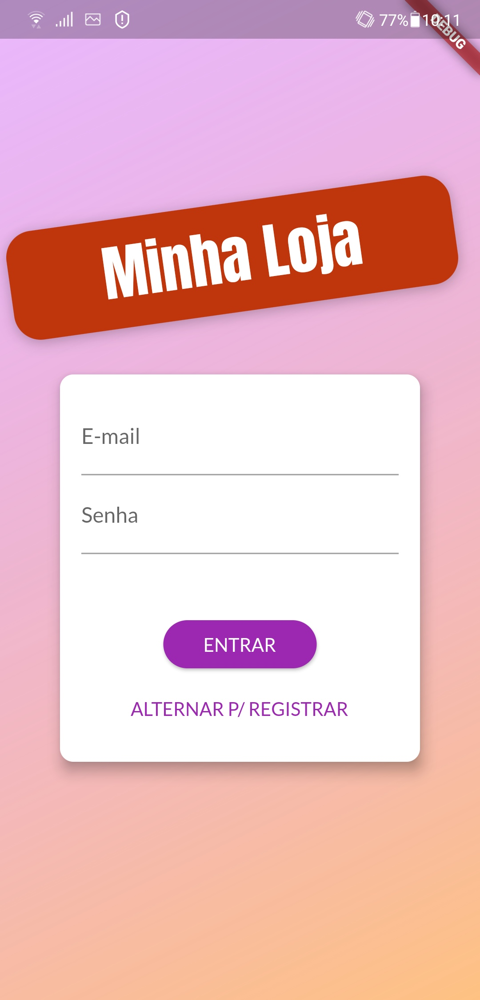
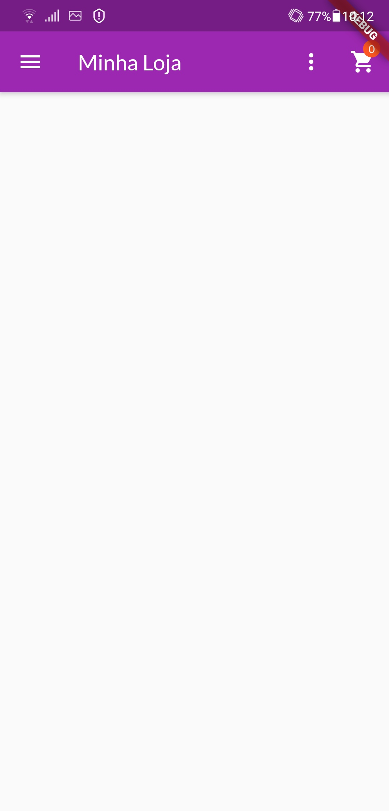
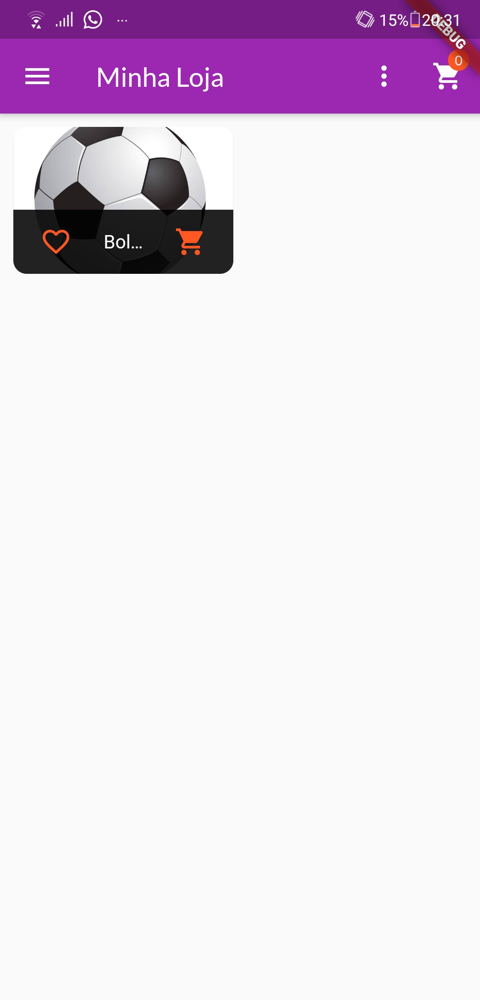

# shop

Um projeto do curso de Flutter da Cod3r com o intuito de apresentar novas funcionalidades do Flutter

## Como usar
Abra o seu Prompt de Comando, se estiver no Windows, ou seu Terminal, caminhe ate o diretorio desejado para criar o repositório e digite flutter create shop  <<< Pode-se trocar o "shop" pelo o nome que achar melhor 
Após isso, coloque esse conteudo lá dentro

## Screenshots

### Tela de Login via Firebase
Tela de login usando o Firebase, nessa tela se você já tiver um cadastro pode apenas inseri-lo e clicar em entrar. Caso não possua um cadastro, clique em "ALTERNAR P/ REGISTRAR" e siga o procedimento para a criação

### Tela inicial
Ao colocar seu login e entrar vai aparecer a tela inicial da aplicação, aonde ira apresentar todos os itens a venda (caso haja algum, como podem ver no exemplo das imagens)

 
