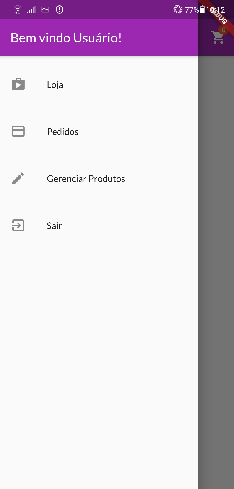
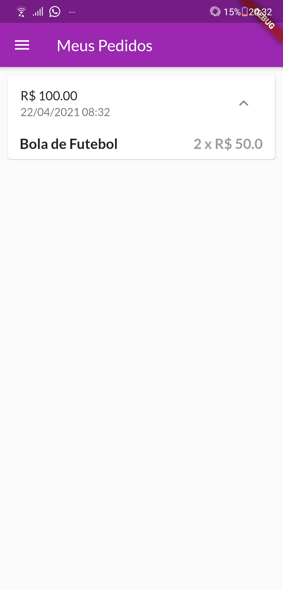
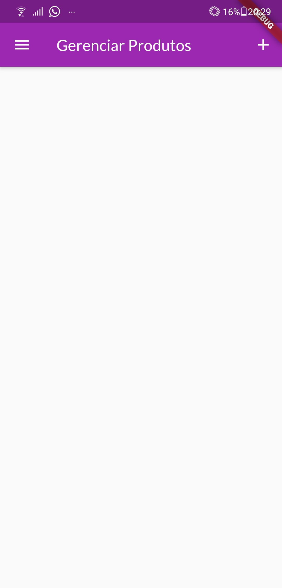
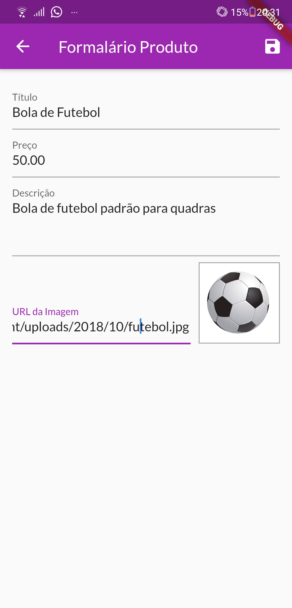
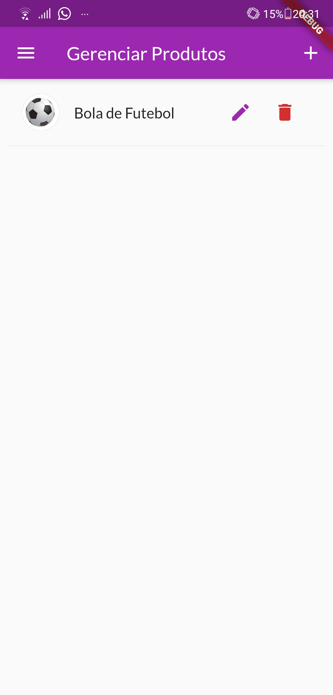
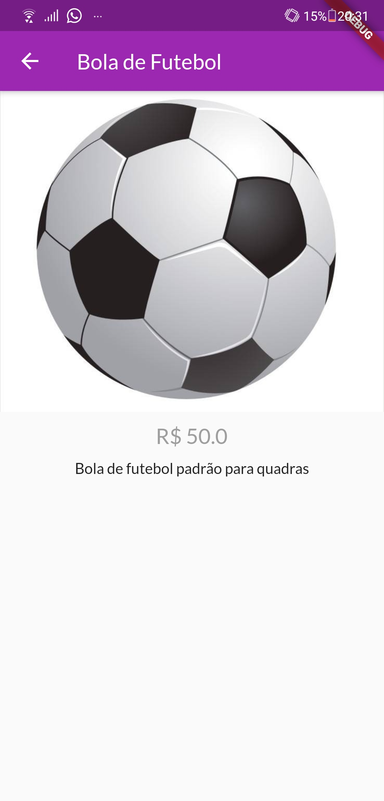
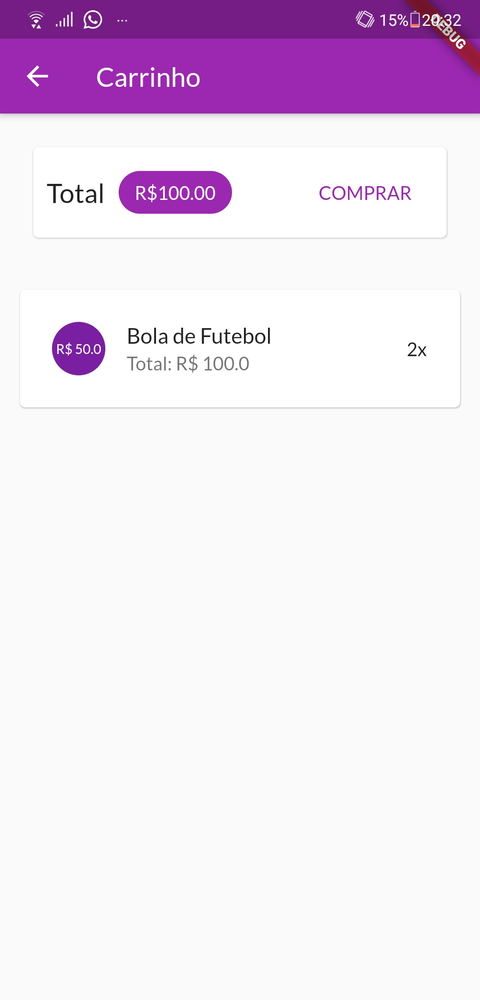

# Shop

Um projeto do curso de Flutter da Cod3r com o intuito de apresentar novas funcionalidades do Flutter

## Como usar
Abra o seu Prompt de Comando, se estiver no Windows, ou seu Terminal, caminhe ate o diretório desejado para criar o repositório e digite flutter create shop  <<< Pode-se trocar o "shop" pelo o nome que achar melhor 
Após isso, coloque esse conteúdo lá dentro


## Screenshots

### Tela de Login via Firebase
Tela de login usando o Firebase, nessa tela se você já tiver um cadastro pode apenas inseri-lo e clicar em entrar. Caso não possua um cadastro, clique em "ALTERNAR P/ REGISTRAR" e siga o procedimento para a criação


### Tela inicial
Ao colocar seu login e entrar vai aparecer a tela inicial da aplicação, aonde ira apresentar todos os itens a venda (caso haja algum, como podem ver no exemplo das imagens)

Tela inicial sem item           |  Tela inicial com item
:-------------------------:|:-------------------------:
   |  

### Menu com as opções da aplicação
Este menu contém as opções de ações e navegação disponíveis. 
Exemplos das ações e navegações:



##### Resultado da ação de cada opção (para qual tela vai):

<table>
  <tr>
    <td>Tela Loja</td>
     <td>Tela Pedidos (Com um pedido já feito)</td>
     <td>Tela Gerenciar Produtos</td>
     <td>Ao Clicar em "Sair, volta para a tela de login</td>
  </tr>
  <tr>
    <td valign="top"></td>
    <td valign="top"></td>
    <td valign="top"></td>
    <td valign="top"></td>
  </tr>
 </table>


### Como adicionar produtos
Para adicionar produtos é só ir no menu localizado no canto superior esquerdo, conforme mostrado anteriormente acima, e clicar em gerenciar produtos. Ao entrar nessa tela terá um ícone de mais (+) no canto superior direito, clicando nele irá abrir a tela de formulário para inserir o item, preencha e clique no ícone no canto superior direito.
OBS: O item adicionado apenas poderá ser gerenciado (editado ou removido) pelo usuário que o colocou, porém poderá ser visto na Loja por todos!

<table>
  <tr>
    <td>Exemplo de formulário já preenchido</td>
    <td>Como ira ficar após inserir o item</td>
    <td>Tela da Loja com o item cadastrado</td>
    <td>Tela do produto (ao clicar nele em Loja)</td>
  </tr>
  <tr>
    <td valign="top"></td>
    <td valign="top"></td>
    <td valign="top"></td>
    <td valign="top"></td>
  </tr>
 </table>

### Fazendo um pedido (simples)
Para realizar o pedido de compra de um item, basta ir para a Loja e clicar sobre o símbolo do carrinho de compras localizado no item. Fazendo isso, aquele item irá para o seu carrinho de compras e ficara lá até finalizar a compra.
Finalizando a compra irá gerar sua ordem de compra.

Exemplos:
OBS.: Caso ao comprar um item e queira desistir dele por ter clicado errado ou algo assim, repare que aparece uma "notificação" na parte inferior da tela, clique em "DESFAZER" que o item adicionado será retirado do carrinho. Conforme a primeira imagem...
<table>
  <tr>
    <td>Ação ao clicar em comprar</td>
    <td>Como ira ficar após inserir o item no carrinho</td>
    <td>Compra finalizada</td>
  </tr>
  <tr>
    <td></td>
    <td></td>
    <td></td>
  </tr>
 </table>

## Guia
```
git clone https://github.com/alberesdejesus/Shop-Flutter.git
cd Shop-Flutter
flutter packages get
flutter run
```
Coloque no seu emulador ou Smartphone e aproveite!! 
